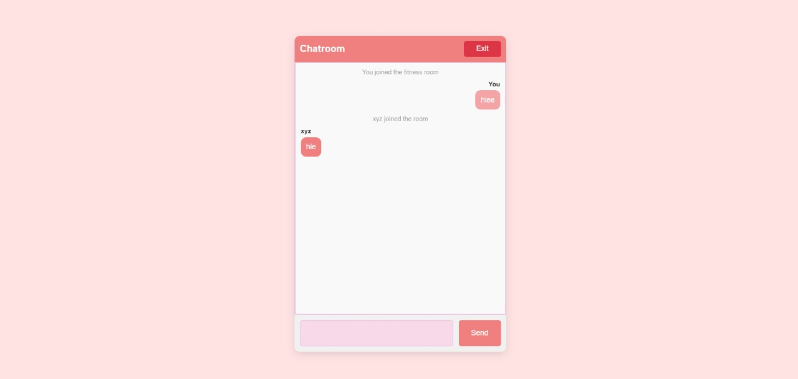
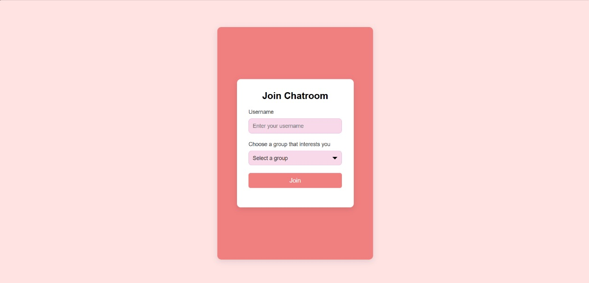
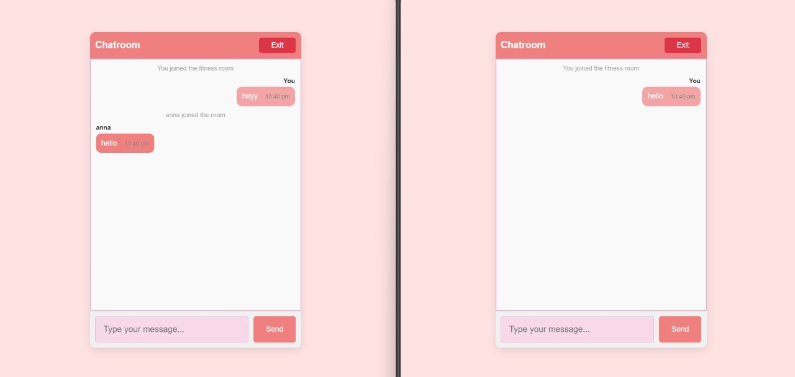
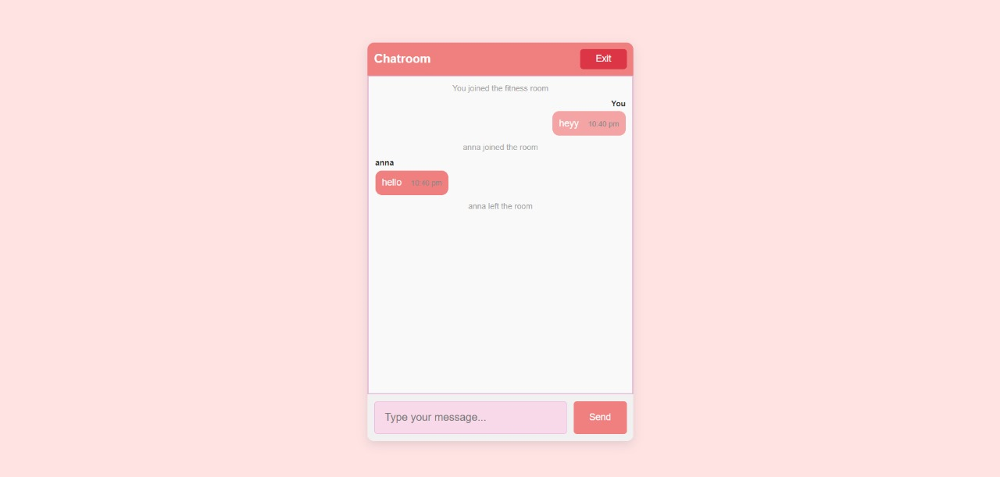

# 💬 **Real-Time Chatroom** 🌍

Welcome to the **EmpowHER Chatroom**! This chatroom facilitates **real-time conversations** between users, allowing women from around the world to connect, share experiences, and offer mutual support. Whether discussing health, careers, or personal challenges, this chatroom ensures instant and seamless communication.

---

## 💡 **Features**

- **Real-Time Messaging**: Instant communication powered by **Socket.IO**, allowing multiple users to chat simultaneously.
- **User-Friendly Interface**: Clean and responsive **HTML** and **CSS** design for accessibility across devices.
- **Multiple Users**: Supports multiple users in the chat, with all messages visible to everyone in the room.
- **User Feedback**: Provides notifications when a user joins or leaves the chat, keeping everyone informed.
- **Auto-Scroll**: Automatically scrolls to the newest message, ensuring no conversation is missed.

---

## 💻 **Technologies Used** 🔧

The chatroom leverages these technologies for real-time communication and a responsive interface:

- **HTML5** 🖼️: Structures the layout and elements of the chatroom.
- **CSS3** 🎨: Styles the interface, ensuring it is both responsive and user-friendly.
- **JavaScript** ✨: Handles client-side interactions.
- **Socket.IO** 🔄: Powers real-time communication between clients and the server for instant message delivery.

---

## 📸 **Screenshots**

Here’s what the chatroom looks like in action:

1. **Chatroom Interface**  
   - Screenshot showing the chatroom with input fields and messages.  
   
 
 

2. **User Joining the Chat**  
   - Screenshot showing the notification when a new user joins the chatroom.  
   

3. **Real-Time Messaging**  
   - Screenshot showing multiple users sending messages in real-time.  
   


---

## 🛠️ **Installation & Setup** 🚀

To set up the **Real-Time Chatroom** locally, follow these steps:

### Step 1: Clone the repository
```bash
git clone https://github.com/Aisha-Fathima/chat_room-main.git
```

### Step 2: Navigate to the project folder
```bash
cd chat_room-main
```

### Step 3: Install dependencies
```bash
npm install
```

### Step 4: Start the server
```bash
node server.js
```

### Step 5: Open the chatroom
Navigate to `http://localhost:3000` in your browser to start chatting!

---

## 🌍 **How It Works**

1. **User Joins**: When a user joins, their username is broadcasted to all participants, welcoming them to the conversation.
2. **Real-Time Chatting**: Users can type messages into the chat input box, and all participants will see the message instantly.
3. **User Leaves**: When a user leaves the chatroom, a message notifies the remaining participants.
4. **Auto-Scrolling**: Messages are auto-scrolled to ensure that you are always viewing the latest conversation.

---

## 🤝 **Contributing**

Interested in contributing to this project? Here’s how you can help:

1. **Fork the repository**.
2. **Create a new branch** for your feature:
   ```bash
   git checkout -b feature-branch
   ```
3. **Make your changes** and commit them:
   ```bash
   git commit -m "Added new feature"
   ```
4. **Push to the branch**:
   ```bash
   git push origin feature-branch
   ```
5. **Open a pull request** and explain your changes!

---

## 🎉 **Let’s Chat!** 🎉

Thank you for checking out the **EmpowHER Chatroom**. Jump in and start connecting with amazing people from all around the world!

---

